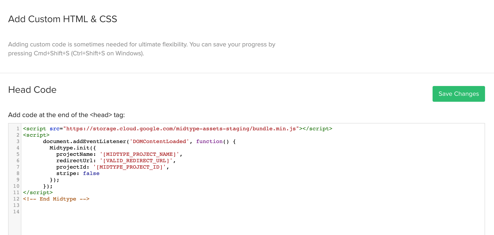
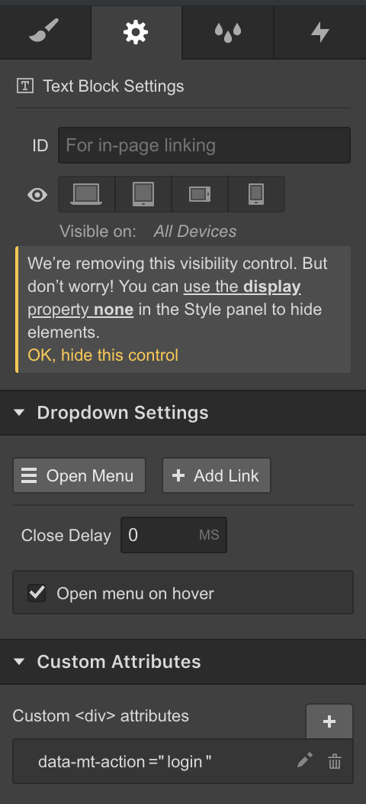

# Midtype.js

Midtype.js makes it easy to use Midtype backends in HTML and Webflow projects. Please note that in this README, we will be using [some of terms defined here](https://www.midtype.com/docs/getting-started/definitions/).

## Getting Started
To use Midtype in your HTML or Webflow project, [sign up](https://www.midtype.com/docs/getting-started) for an account and design your API. The names of the models and fields you define in the Midtype UI determine how you access that data to perform create, read, and update operations with this SDK.

### Quickstart
---
#### Step 1: Insert Your Snippet
Paste your code snippet before the `</head>` tag in every page of your project. For Webflow, this is done by navigating to your site's project settings (`https://webflow.com/dashboard/sites/[SITE_NAME]/general`) > Code > Head Code:



Here's a sample of what the code snippet should look like:

```html
<script src="https://storage.cloud.google.com/midtype-assets-staging/bundle.min.js"></script>
<script>
document.addEventListener('DOMContentLoaded', function() {
  Midtype.init({
    projectName: '[MIDTYPE_PROJECT_NAME]',
    redirectUrl: '[VALID_REDIRECT_URL]', // This is should be a URL on your domain
    projectId: '[MIDTYPE_PROJECT_ID]',
    stripe: false
  });
});
</script>
```
---
#### Step 2: Add a Login Button

Add an HTML button on your page with the `data-mt-action="login"` tag to your page:

```html
<button data-mt-action="login">Login</Login>
```

Do this in Webflow by adding a button to your layour, and specifying a custom attribute in the "Element Settings (D)" section for the button:



Clicking this button will open up a login menu for your app. Log into the app to continue.

---

#### Step 3: Show User data

Once a user is logged in. Let's add a `<h1>` that displays their name and an `` with their profile picture. We must wrap these elements in a div that specifies the model we're getting data from. In this case, it's the `user` model:

```html
<div data-mt-model="user">
  <h1 data-mt-field="name"></h1>
  
</div>
```

Now, we can do the same for any other model we have [defined in our Midtype project](https://app.midtype.com/models). See the full API reference below for the list of data attributes that can be used.

## API Reference
You can easily attach data to your HTML elements using `data` attributes. You can also perform standard create and update operations on any object using HTML forms in conjunction with these attributes.

| Attribute                 | Value                                          | HTML Elements | Purpose                                                                                                                                                                                                                                              |
| ------------------------- | ---------------------------------------------- | ------------- | ---------------------------------------------------------------------------------------------------------------------------------------------------------------------------------------------------------------------------------------------------- |
| `data-mt-model`           | Any Model Name                                 | All           | Show data for a single record.  Must be used in conjunction with `data-mt-model-id` unless the model is `user`.                                                                                                                                      |
| `data-mt-model-id`        | `UUID`                                         | All           | Must be used in conjunction with `data-mt-model` to specify which record to show data for.                                                                                                                                                           |
| `data-mt-nodes`           | Any Model Name                                 | All           | Show  all records of the given model. Immediate child of element with this attribute must be a `<div>`.                                                                                                                                              |
| `data-mt-field`           | Any Field for Parent Model                     | All           | When used as a child of an element with `data-mt-model` or `data-mt-nodes`, it is injected with data from the given field. Supports dot notation for sub-fields (e.g. `photo.location`)                                                              |
| `data-mt-form`            | Any Model Name                                 | `<form>`      | Allows user to create or update records of this model, based on child `<input>` elements. `<form>` must include an `<input type="submit" />` element.                                                                                                |
| `data-mt-form-id`         | `UUID`                                         | `<form>`      | If used in conjunction with `data-mt-form`, allows user to update fields on the record with the given ID.                                                                                                                                            |
| `data-mt-form-field`      | Any Field for Parent Model                     | `<input>`     | When user submits the given form, the `value` attribute for this input will be saved for this the given field.                                                                                                                                       |
| `data-mt-form-field-type` | `user`, `number`, `string`, `asset`, `boolean` | `<input>`     | The data type for a given input field. If the value is `asset`, the `<input>` must also have attribute `type="file"`. If value is `boolean`, `<input>` must also have attribute `type="checkbox"`. If no field type specified, defaults to `string`. |
| `data-mt-if`              | `user`                                         | All           | Any element with this tag will be shown only if there is a user currently logged in.                                                                                                                                                                 |
| `data-mt-if-not`          | `user`                                         | All           | Any element with this tag will be shown only if there is **not** a user currently logged in.                                                                                                                                                         |

### Examples

For these examples, we will assume our Midtype backend has a model named `task` with the following fields:
- `summary` - `string`
- `screenshot` - `linked asset`
- `owner` - `linked user`
- `completed` - `boolean`

---

#### Show a Single Record

To show a single data record, you can add `data-mt-model="[MODEL NAME]"` to any HTML element. This must be used in conjunction with `data-mt-model-id="[SINGLE MODEL ID]"` to specify which record, specifically, you would like to be fetched. One notable exception to this rule is the `user` model, which can be used without specifying an `id`. Omitting the `id` in this case defaults to showing data for the logged in user.

```html
<div data-mt-model="task" data-mt-model-id="312418da-de30-425a-8d6b-cad6a7402345">
  <h3>Summary: <span data-mt-field="summary"></span></h1>
  <h4 data-mt-field="owner.name"></h4>
  
</div>
```

If we want to show the logged-in user's data, we do not need to include a `data-mt-model-id` attribute:

```html
<div data-mt-model="user">
  <h3>Hello <span data-mt-field="name"></span>!</h1>
  <h4 data-mt-field="email"></h4>
  
</div>
```

---

#### Show a List of Records

The `data-mt-nodes` tag can be used similarly to `data-mt-model`, except it will automatically fetch all records of the model you specify that the logged in user has access to. **The immediate child of any HTML element with this tag must be a `<div>`.** This child `<div>` will be duplicated for the number of records that exist for this model.

```html
<div data-mt-nodes="task">
  <div>
    <h3>Summary: <span data-mt-field="summary"></span></h1>
    <h4 data-mt-field="owner.name"></h4>
    
  </div>
</div>
```

---

#### Create a New Record

```html
<form data-mt-form="task">
  <input
    type="text"
    data-mt-form-field="ownerId"
    data-mt-form-field-type="user"
  />
  <input
    type="text"
    data-mt-form-field="summary"
    data-mt-form-field-type="string"
  />
  <input
    type="file"
    accept="image/png, image/jpeg"
    data-mt-form-field="screenshotId"
    data-mt-form-field-type="asset"
  />
  <input
    type="checkbox"
    data-mt-form-field="completed"
    data-mt-form-field-type="boolean"
  />
  <input type="submit" value="Submit" />
</form>
```

---

#### Update an Existing Record

The HTML for updating a record is almost identical to that for creating one, except we must also specify a `data-mt-form-id` value.

```html
<form data-mt-form="task" data-mt-form-id="312418da-de30-425a-8d6b-cad6a7402345">
  <input
    type="text"
    data-mt-form-field="ownerId"
    data-mt-form-field-type="user"
  />
  <input
    type="text"
    data-mt-form-field="summary"
    data-mt-form-field-type="string"
  />
  <input
    type="file"
    accept="image/png, image/jpeg"
    data-mt-form-field="screenshotId"
    data-mt-form-field-type="asset"
  />
  <input
    type="checkbox"
    data-mt-form-field="completed"
    data-mt-form-field-type="boolean"
  />
  <input type="submit" value="Submit" />
</form>
```

## Running This Project Locally

You can use this project as a demo to understand how the Midtype Javascript SDK works.

1. Make sure you have Node (v8.11.0+) and Yarn installed.
2. Run `yarn` in the root of this project to install dependencies.
3. Run `yarn start` in the root of this project to see a sample of the SDK being used on the `src/public/index.html` file.
4. Navigate to `localhost:3000` to see the project in action. Making changes to the source code will automatically reload the page with changes.
